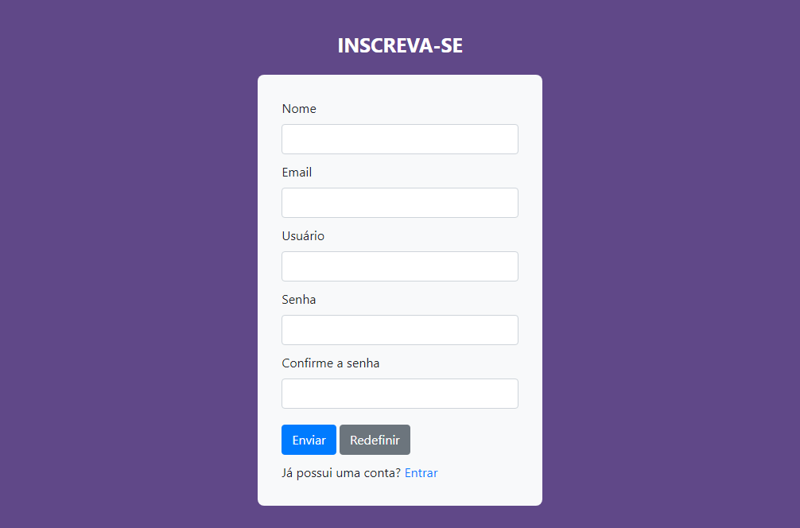
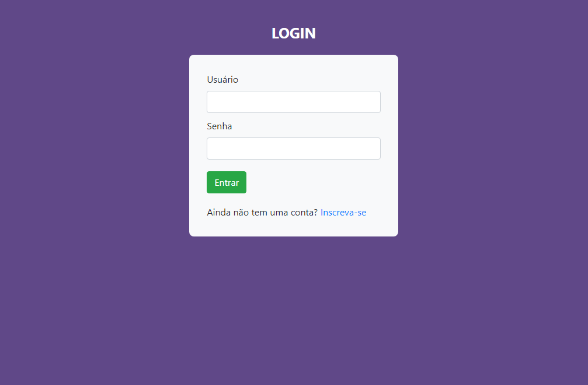

<h2 align="center">
  Formulário para cadastro e login de usuário
</h2>

<!--

</img>

</img>
-->
---

## Tecnologias e ferramentas
Para o desenvolvimento deste projeto utilizei:
- JavaScript
- HTML5
- CSS3
- Bootstrap v4.0
- Visual studio Code v1.67.1
